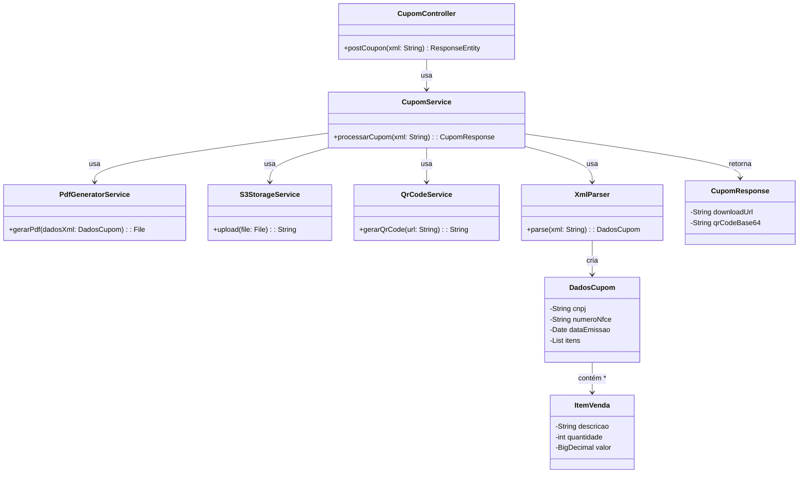

```mermaid
classDiagram
    class CupomController {
        +postCoupon(xml: String) ResponseEntity<CupomResponse>
    }

    class CupomService {
        +processarCupom(xml: String): CupomResponse
    }

    class PdfGeneratorService {
        +gerarPdf(dadosXml: DadosCupom): File
    }

    class S3StorageService {
        +upload(file: File): String
    }

    class QrCodeService {
        +gerarQrCode(url: String): String
    }

    class XmlParser {
        +parse(xml: String): DadosCupom
    }

    class CupomResponse {
        -String downloadUrl
        -String qrCodeBase64
    }

    class DadosCupom {
        -String cnpj
        -String numeroNfce
        -Date dataEmissao
        -List<ItemVenda> itens
    }

    class ItemVenda {
        -String descricao
        -int quantidade
        -BigDecimal valor
    }

    %% Relacionamentos
    CupomController --> CupomService : usa
    CupomService --> XmlParser : usa
    CupomService --> PdfGeneratorService : usa
    CupomService --> S3StorageService : usa
    CupomService --> QrCodeService : usa
    CupomService --> CupomResponse : retorna
    XmlParser --> DadosCupom : cria
    DadosCupom --> ItemVenda : contém *

```
