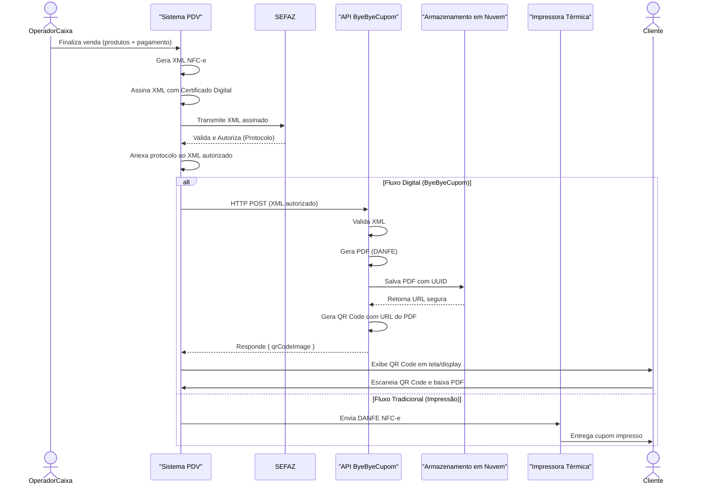

```mermaid
sequenceDiagram
    actor Caixa as OperadorCaixa
    participant PDV as "Sistema PDV"
    participant SEFAZ
    participant API as "API ByeByeCupom"
    participant Storage as "Armazenamento em Nuvem"
    participant Impressora as "Impressora Térmica"
    actor Cliente

    %% Parte 1 - Fluxo Padrão
    Caixa ->> PDV: Finaliza venda (produtos + pagamento)
    PDV ->> PDV: Gera XML NFC-e
    PDV ->> PDV: Assina XML com Certificado Digital
    PDV ->> SEFAZ: Transmite XML assinado
    SEFAZ -->> PDV: Valida e Autoriza (Protocolo)
    PDV ->> PDV: Anexa protocolo ao XML autorizado

    %% Parte 2 - Após autorização, duas opções
    alt Fluxo Digital (ByeByeCupom)
        PDV ->> API: HTTP POST (XML autorizado)
        API ->> API: Valida XML
        API ->> API: Gera PDF (DANFE)
        API ->> Storage: Salva PDF com UUID
        Storage -->> API: Retorna URL segura
        API ->> API: Gera QR Code com URL do PDF
        API -->> PDV: Responde { qrCodeImage }
        PDV ->> Cliente: Exibe QR Code em tela/display
        Cliente ->> PDV: Escaneia QR Code e baixa PDF
    else Fluxo Tradicional (Impressão)
        PDV ->> Impressora: Envia DANFE NFC-e
        Impressora ->> Cliente: Entrega cupom impresso
    end

```
