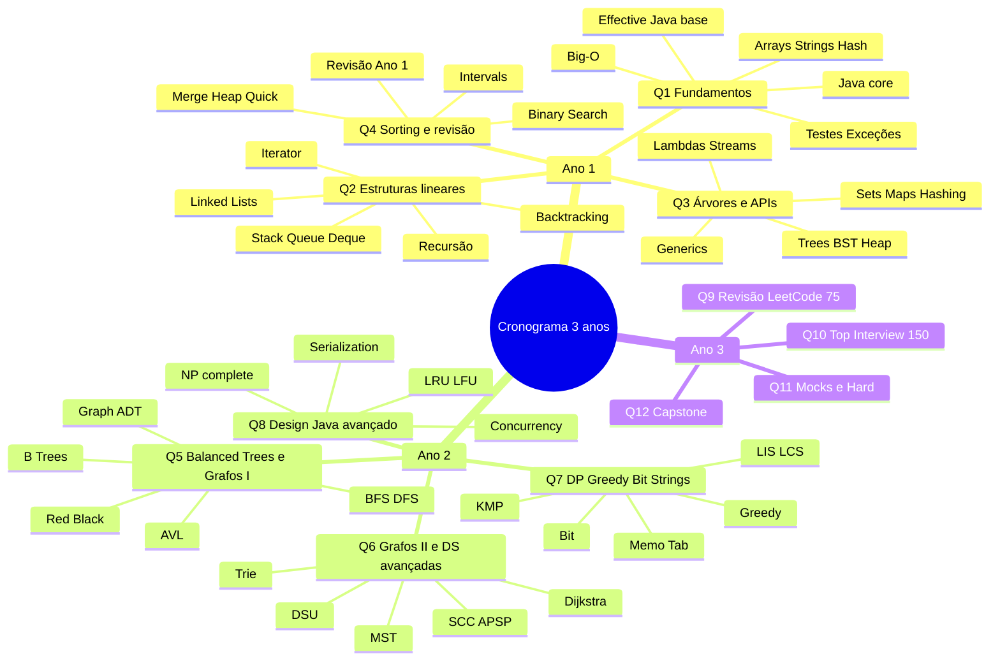

# Mindmap — Cronograma Java + LeetCode + 3 anos

## Estrutura em árvore (compatível com plugins de mindmap por bullets)

- Cronograma 3 anos
  - Ano 1
    - Q1 Fundamentos de Java, ADTs e análise inicial
      - Java core
      - Effective Java: objetos, classes, métodos de criação
      - Big-O, arrays, strings, hash introdutório
      - Testes, debugging, exceções
    - Q2 Listas ligadas, iteradores, stack, queue, deque e recursão
      - Single/double linked list
      - Iterator / Iterable
      - Stack / Queue / Deque
      - Recursão, busca binária, backtracking
    - Q3 Árvores, heaps, BST, hashing, generics, lambdas e streams
      - Binary trees e traversals
      - BST e heap
      - Sets, maps, hash tables
      - Generics, wildcards, lambdas, streams
    - Q4 Sorting, divide and conquer, intervals, revisão Ano 1
      - Merge / Heap / Quick sort
      - Binary search patterns
      - Intervals e monotonic patterns
      - Revisão espiral
  - Ano 2
    - Q5 Balanced trees, B-trees, skip-lists e grafos I
      - AVL e Red-Black
      - 2-3 trees / B-trees / skip-lists
      - Graph ADT
      - BFS / DFS / topo sort
    - Q6 Grafos II, shortest paths, MST, DSU, tries
      - Dijkstra / Bellman-Ford / Floyd-Warshall
      - MST
      - Union-Find
      - Trie e string matching
      - Amortized analysis / advanced DS
    - Q7 Dynamic Programming, greedy, matemática, bits e strings
      - 1D DP / 2D DP / interval DP
      - Greedy proofs
      - Bit manipulation
      - Number theory
      - KMP / Rabin-Karp / Aho-Corasick
    - Q8 Geometria, NP-complete, aproximação, design, concorrência, serialização
      - Geometry high level
      - NP-complete / approximation
      - LRU / LFU / TimeMap / MedianFinder
      - Concurrency
      - Serialization
  - Ano 3
    - Q9 Revisão espiral I com LeetCode 75
      - Arrays / strings / stacks / trees / graphs / DP
    - Q10 Top Interview 150 + NeetCode 150
      - Packs por padrão
      - Refatoração de soluções
    - Q11 Mocks, timed sets e hard patterns
      - Whiteboard
      - Contest routine
      - Dry run
    - Q12 Fechamento e capstone
      - Repositório final
      - Templates Java
      - Cheatsheets
      - Plano pós-3 anos

## Mermaid mindmap

