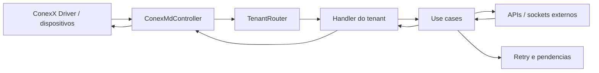
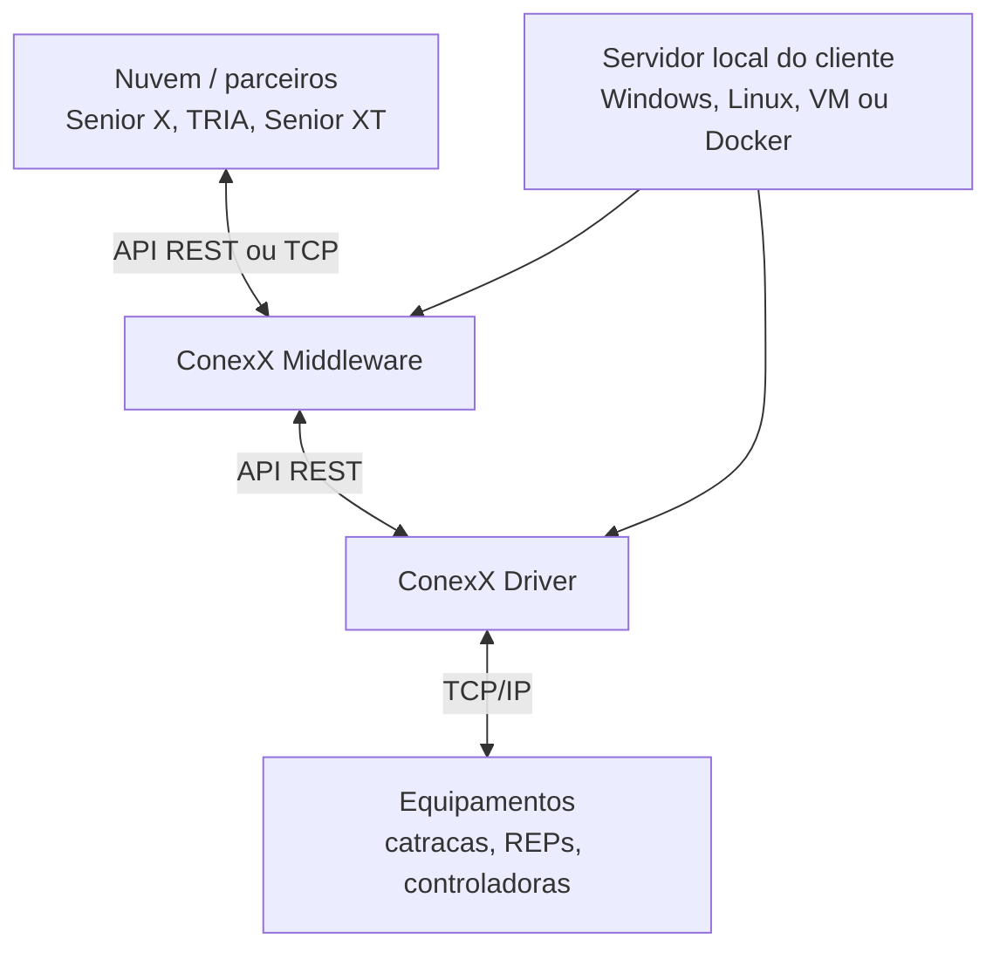
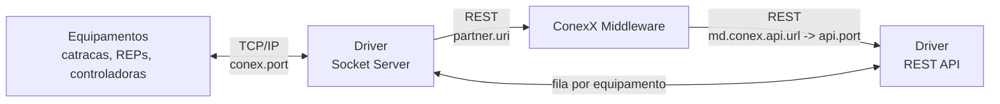
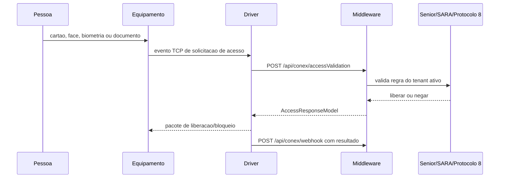
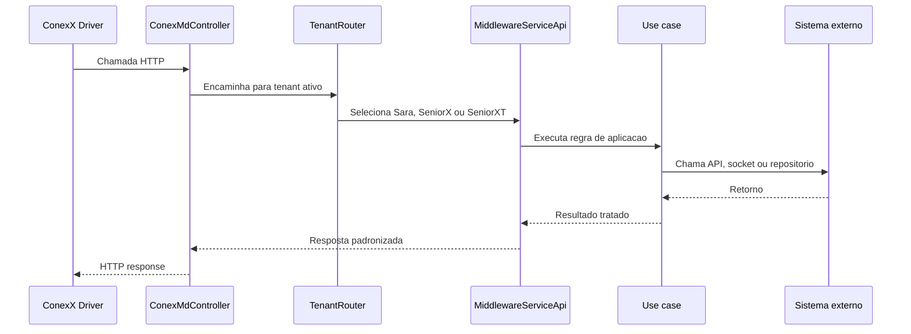

# Documentacao do Projeto - ConexX Middleware V2 + ConexX Driver

## 1. Visao geral

Este documento cobre o **ConexX Middleware V2** e, agora, tambem o **ConexX Driver** conectado neste workspace.

O **ConexX Middleware V2** é uma aplicacao Java/Spring Boot que atua como uma camada intermediaria entre o **ConexX Driver** e sistemas externos de controle de acesso.

Na pratica, ele recebe eventos, comandos e validações vindos de equipamentos ou do driver, traduz essas mensagens para o formato esperado por cada integração externa, chama APIs ou sockets externos, e devolve respostas para manter o fluxo de acesso funcionando.

Segundo o README do projeto, o middleware foi construído para integrar o ConexX Driver com diferentes ecossistemas, principalmente:
- **SARA / TOTVS**
- **Senior X**
- **Senior XT / Protocolo 8**

O Middleware usa **Java 17**, **Spring Boot 3.5.9**, **Maven**, **Thymeleaf**, **Quartz**, **SpringDoc/OpenAPI**, **Log4j2**, **Docker/Compose** e empacotamento com suporte a instalador Windows via Inno Setup.

O Driver usa **Java 17**, **Spring Boot 3.2.3**, **Maven**, **Spring Security**, **SpringDoc/OpenAPI**, **Log4j2**, sockets TCP, serviço Windows via `prunsrv` e instalador Windows via Inno Setup.

## 2. Problema que o projeto resolve
Ambientes de controle de acesso normalmente possuem varias peças conversando ao mesmo tempo:
- equipamentos físicos, como controladoras, leitores, catracas, leitores faciais e REPs;
- o ConexX Driver, que conversa mais diretamente com os dispositivos;
- sistemas corporativos externos, como Senior, TOTVS/SARA ou Protocolo 8;
- rotinas de sincronização de pessoas, biometria, dispositivos, comandos e eventos;
- webhooks, sockets, filas em memoria, tentativas de reenvio e pendencias.

O middleware existe para evitar que cada equipamento ou cada fluxo precise conhecer diretamente a regra de cada sistema externo. Ele centraliza a tradução.

Em uma frase:
> O ConexX Middleware V2 e um tradutor operacional entre o mundo dos dispositivos/driver e o mundo dos sistemas corporativos de acesso.

## 3. Principais conceitos
### Middleware
E a camada intermediaria. Ela não e exatamente o sistema final de gestão de acesso e também não e apenas o driver de dispositivo. Ela fica no meio, recebendo, interpretando, roteando e respondendo...

### Tenant
No projeto, **tenant** representa o tipo de integração ativa. O #tenant decide qual implementação do fluxo sera usada.
Os principais tenants são:

| Tenant | Integracao | Classe de servico principal | Manager principal |
| --- | --- | --- | --- |
| `sara` | SARA / TOTVS | `SaraHandler` | `SaraManager` |
| `seniorx` | Senior X | `SeniorXHandler` | `SeniorXManager` |
| `protocolo8` | Senior XT / Protocolo 8 | `SeniorXtHandler` | `SeniorXtManager` |
| `seniorxt` | Senior XT / Protocolo 8 | `SeniorXtHandler` | `SeniorXtManager` |

O tenant e configurado pela propriedade `md.tenant.client`.

### Handler
Handler e a classe que <span style="background:#d3f8b6">implementa o contrato comum do middleware</span> para um tenant especifico.

Exemplos:
- `SaraHandler`
- `SeniorXHandler`
- `SeniorXtHandler`
Essas classes implementam `MiddlewareServiceApi`, que é a interface comum usada pelo controller.
### Manager
Manager é o componente que inicializa ou encerra recursos específicos de uma integração.
Exemplos:
- `SaraManager` agenda jobs de busca de dispositivos.
- `SeniorXManager` inicia jobs e conexões websocket.
- `SeniorXtManager` gerencia socket TCP, autenticação, keep-alive e reconexão.

### Use case
Use case concentra regra de aplicação. Ele representa uma operação de negocio, como validar acesso, enviar comando para dispositivo, sincronizar lista de pessoas ou processar webhook.

Exemplos:
- `AccessValidationSaraUseCase`
- `AccessValidationSeniorUseCase`
- `DeviceUseCase`
- `DeviceCommandUseCase`
- `ListDataCommandUseCase`
- `WebhooksUsecase`

### Adapter
O projeto segue uma ideia próxima de arquitetura hexagonal:

- adaptadores de entrada recebem chamadas HTTP, websocket ou socket;
- adaptadores de saída chamam APIs externas, banco, arquivos ou outros servicos;
- o domínio e a aplicação ficam no centro.

## 4. Arquitetura em camadas
A estrutura principal fica em:

```text
src/main/java/br/com/telematica/conex/middleware/v2
```

Ela se organiza assim:

```text
domain/
  Modelos, entidades, enums, portas, contratos e servicos comuns.

application/
  Casos de uso, handlers de tenant, estrategias e regras de aplicacao.

infrastructure/
  Controllers HTTP, sockets, clientes HTTP externos, configuracoes e persistencia.

src/main/resources/
  Configuracoes, templates Thymeleaf, arquivos estaticos e log4j2.
```

O desenho mental mais importante e este:



## 4.1 Onde ficam middleware, driver e equipamentos
Pelo desenho de arquitetura, existem tres zonas fisicas/logicas:

```text
Nuvem / parceiros
  Senior X, TRIA, Senior XT ou outros sistemas externos.

Local do cliente
  Servidor, VM, mini-PC ou computador industrial onde rodam o Middleware e o Driver.

Equipamentos
  Catracas, REPs, controladoras, leitoras faciais e outros dispositivos.
```

O ponto mais importante:

> O middleware e o driver normalmente não ficam dentro da catraca. Eles rodam em uma maquina local do cliente, na mesma rede ou em uma rede com acesso aos equipamentos.

Normalmente essa maquina local precisa ter um endereço estável na rede, de preferencia **IP fixo** ou reserva DHCP. Isso evita que os equipamentos percam comunicação caso o IP do servidor mude.

Em uma instalação típica:
- os equipamentos apontam para o IP/host do servidor onde está o **Driver**;
- o **Middleware** aponta para a <span style="background:#fff88f">API do Driver</span> pela propriedade `md.conex.api.url`;
- os sistemas externos, quando precisam chamar o middleware, apontam para o IP/host e porta onde o middleware esta publicado.

Exemplo conceitual:

```properties
md.conex.api.url=http://192.168.0.10:59974
```

Nesse exemplo, `192.168.0.10` seria o servidor local onde o Driver esta respondendo.

Uma instalação comum fica assim:



### Papel de cada parte

| Parte                       | Onde costuma ficar                                                         | Papel                                                                              |
| --------------------------- | -------------------------------------------------------------------------- | ---------------------------------------------------------------------------------- |
| Equipamento                 | Fisicamente na portaria, entrada, refeitorio, fabrica, estacionamento etc. | Controla o acesso real: libera giro, registra ponto, le cartao, face ou biometria. |
| Driver                      | Servidor/PC/VM local do cliente, perto da rede dos equipamentos.           | Fala diretamente com os equipamentos por TCP/IP e expoe uma API para o middleware. |
| Middleware                  | Normalmente no mesmo servidor do driver ou em outra VM/maquina local.      | Traduz os fluxos entre driver/equipamentos e sistemas externos.                    |
| Senior X / TRIA / Senior XT | Geralmente nuvem ou ambiente externo do parceiro/empresa.                  | Sistema corporativo que decide regras, recebe eventos ou fornece dados.            |

### O que e "Conex" ou "ConexX"
No contexto deste projeto, **ConexX** parece ser o nome da plataforma/ecossistema da Telematica para comunicação  com equipamentos de acesso e ponto.

Quando o projeto fala em **Conex**, normalmente esta se referindo a esse lado interno da solucao:
- **ConexX Driver**: componente instalado no ambiente do cliente que conversa diretamente com os equipamentos.
- **ConexX Middleware**: este projeto, que traduz e integra o Driver com Senior, SARA/TOTVS, TRIA ou Protocolo 8.
- **API Conex** ou `md.conex.api.url`: a URL pela qual o Middleware chama o Driver.
- modelos/classes com prefixo `Conex`: objetos usados para mandar comandos ou dados no formato esperado pelo Driver.

Entao, de forma simples:

```text
ConexX = nome do ecossistema/produto
ConexX Driver = fala com catracas/REPs/leitores
ConexX Middleware = fala com Driver e sistemas externos
```

### Exemplo pratico

Imagine uma catraca na portaria de uma empresa:
1. A pessoa apresenta cartão, face, biometria ou documento na catraca.
2. A catraca conversa por rede com o **ConexX Driver**.
3. O driver chama o **ConexX Middleware** por API REST.
4. O middleware pergunta ou notifica o sistema externo, como Senior X, SARA/TOTVS ou Senior XT.
5. O sistema externo responde se pode liberar, bloquear ou registrar o evento.
6. O middleware devolve a resposta para o driver.
7. O driver manda o comando final para a catraca.

Em resumo:
```text
Pessoa -> Catraca -> Driver -> Middleware -> Sistema externo
Pessoa <- Catraca <- Driver <- Middleware <- Sistema externo
```

### Quando middleware e driver ficam na mesma maquina
Esse e o cenário mais simples e comum:
```text
Servidor local do cliente
  - ConexX Driver
  - ConexX Middleware
```
Vantagens:
- menos configuração de rede entre driver e middleware;
- menor latência;
- manutenção mais simples;
- facilita uso de `localhost` ou IP interno.

### Quando middleware e driver ficam em máquinas diferentes
Também pode acontecer:

```text
Servidor A
  - ConexX Driver

Servidor B
  - ConexX Middleware
```

Nesse caso, o servidor do middleware precisa conseguir acessar a API do driver, e o servidor do driver precisa conseguir falar com os equipamentos.

### Quando o middleware poderia ficar na nuvem

Tecnicamente, o middleware poderia rodar fora da rede local, mas isso exige que ele consiga se comunicar com o driver e/ou que o driver consiga chamar o middleware pela rede.

Na pratica, para controle de acesso fisico, costuma ser mais seguro e simples manter driver e middleware no ambiente local do cliente, porque os equipamentos estao na rede local.

## 4.2 Contexto Suricato Docs

Esta secao resume o contexto externo lido na documentacao oficial Suricato Docs em 2026-05-17:

- <https://software-telematica-com.gitbook.io/suricato-docs>
- <https://software-telematica-com.gitbook.io/suricato-docs/conex/conexx-e-xt>
- <https://software-telematica-com.gitbook.io/suricato-docs/conex/conexx-e-xt/conexx-driver>
- <https://software-telematica-com.gitbook.io/suricato-docs/conex/conexx-e-xt/conexx-ou-xt-middleware>
- <https://software-telematica-com.gitbook.io/suricato-docs/conex/conexx-e-xt/conexx-ou-xt-middleware/configuracao-do-conexx-middleware>

### Suricato

O Suricato e a plataforma/ecossistema maior de gestão de segurança da Telemática. A documentação descreve o Suricato como uma solução modular, composta por aplicação web e vários serviços Java/Windows.

Serviços citados na documentação:

| Servico             | Papel no ecossistema Suricato                                                            |
| ------------------- | ---------------------------------------------------------------------------------------- |
| Suricato Client     | Ponte entre sistema web e periféricos locais, como biometria de mesa, webcam e leitores. |
| SuriPlayer          | Integrador para equipamentos de diferentes fabricantes.                                  |
| Suricato Middleware | Nucleo de integração para listas e processos externos, como TOTVS em certos cenarios.    |
| GerServ             | Agendador de importações, exportações e rotinas.                                         |
| Matriz de Acesso    | Motor de regras de acesso.                                                               |
| Suricato Face       | Sincronismo facial.                                                                      |
| FaceTemplate        | Conversão de fotos em templates digitais.                                                |
| Suricato ReP        | Rotinas ligadas a registradores eletrônicos de ponto.                                    |
| Suricato REST       | Comunicação por API para cenários de integração/nuvem.                                   |

Esse contexto é importante porque o ConexX Middleware deste repositório não é o Suricato inteiro. Ele e uma peça específica dentro do ecossistema de comunicação com equipamentos e parceiros.

### Conex tradicional x ConexX
A documentação diferencia dois mundos:

```text
Conex tradicional
  Equipamento -> Conex -> Banco Suricato -> Conex -> Equipamento

ConexX / ConexXT
  Equipamento -> ConexX Driver -> ConexX Middleware -> Parceiro
  Equipamento <- ConexX Driver <- ConexX Middleware <- Parceiro
```

No Conex tradicional, a comunicação é mais ligada ao Suricato e seu banco de dados. Para REP, aparece também o ConexREP.

No ConexX/ConexXT, a comunicação é separada em duas responsabilidades:
- **ConexX Driver**: fala diretamente com os equipamentos.
- **ConexX Middleware**: traduz as mensagens para o parceiro configurado.

### ConexX Driver segundo o Suricato Docs
O Driver do ConexX é responsável por toda comunicação com os equipamentos. Ele:
- estabelece e mantem conexão com dispositivos;
- recebe eventos gerados pelos equipamentos;
- envia comandos quando necessário;
- encaminha dados ao Middleware;
- não conhece as regras de negócio dos parceiros.

Configurações importantes do Driver ficam no arquivo `conex.properties`.

Pontos de configuração citados:

| Chave                                | Uso                                                                 |
| ------------------------------------ | ------------------------------------------------------------------- |
| `api.port`                           | Porta da API do Driver, usada pelo Middleware para chamar o Driver. |
| `conex.port`                         | Porta TCP/IP de comunicacao direta com equipamentos.                |
| `partner.uri`                        | URL do Middleware, normalmente `http://IP_DO_MIDDLEWARE:8090`.      |
| `webhook.reprocessIntervalInMinutes` | Intervalo de reprocessamento de webhooks.                           |
| `conex.listaEquipamentosBloqueados`  | Lista de IPs/equipamentos bloqueados.                               |
| `conex.listaEquipamentosLiberados`   | Lista de IPs/equipamentos permitidos.                               |

A documentacao tambem fala em licenciamento por arquivos `Conex.req` e `Conex.res`.

### ConexX Middleware segundo o Suricato Docs

O Middleware do ConexX intermedia a comunicação entre Driver e sistemas parceiros. Ele recebe dados do Driver, interpreta eventos, aplica a regra necessária para cada parceiro, envia no formato correto e trata o retorno.

Configurações importantes do Middleware ficam no arquivo `application.properties`.

Pontos de configuração citados:

| Chave | Uso |
| --- | --- |
| `server.port` | Porta HTTP do Middleware. A documentacao usa `8090` como padrao. |
| `md.tenant.client` | Define o parceiro/tenant ativo. |
| `md.conex.api.url` | Neste repositorio, e a URL usada pelo Middleware para chamar a API do ConexX Driver. |
| `md.restTemplateTimeWaitSecond` | Timeout de conexao interna. |
| `md.restTemplateReadTimeoutSecond` | Timeout de leitura interna. |

Na documentação externa, aparecem valores como `trla`, `seniorx` e `seniorxt`. Neste repositório, o enum `TenantIdentifier` reconhece:

| Valor neste repositorio | Integracao |
| --- | --- |
| `sara` | TOTVS/SARA |
| `seniorx` | Senior X |
| `protocolo8` | Senior XT / Ronda / Protocolo 8 |
| `seniorxt` | Senior XT / Ronda / Protocolo 8 |

Esse desalinhamento de nomes e relevante: a documentaçao externa usa `trla` para TOTVS/TRLA, mas este código usa `sara` para TOTVS/SARA.

### ConexX x ConexXT

A escolha entre ConexX e ConexXT acontece no Middleware, conforme o parceiro:

| Cenario                        | Comunicacao com parceiro | Nome operacional                    |
| ------------------------------ | ------------------------ | ----------------------------------- |
| SeniorX                        | API REST                 | ConexX Driver + ConexX Middleware   |
| SARA/TOTVS/TRLA                | API REST                 | ConexX Driver + ConexX Middleware   |
| SeniorXT / Ronda / Protocolo 8 | TCP/IP / Protocolo 8     | ConexXT Driver + ConexXT Middleware |

Neste repositorio, essa diferenca aparece nas implementacoes por tenant:

- `SeniorXHandler` e `SeniorXManager` para SeniorX/API REST;
- `SaraHandler` e `SaraManager` para SARA/TOTVS/API REST;
- `SeniorXtHandler` e `SeniorXtManager` para Protocolo 8/TCP.

### Onde os serviços podem ficar

A documentação externa cita três possibilidades:

| Topologia | Descricao |
| --- | --- |
| Local/borda | Driver e Middleware instalados localmente no ambiente do cliente. |
| Nuvem | Driver e Middleware instalados em cloud. |
| Hibrida | Driver na borda e Middleware na nuvem. |

Para controle de acesso fisico, o Driver na borda/local costuma fazer sentido porque ele precisa falar com os equipamentos por rede. O Middleware pode estar no mesmo servidor, em outro servidor local ou em nuvem, desde que a comunicacao com o Driver e com o parceiro esteja liberada.

### Diagramas oficiais do ConexX e XT

As imagens abaixo vieram da pagina oficial [Suricato Docs - ConexX e XT](https://software-telematica-com.gitbook.io/suricato-docs/conex/conexx-e-xt) e foram salvas localmente em:

```text
docs/assets/suricato
```

Elas ajudam a fixar as tres topologias que a documentacao considera possiveis.

**1. Driver e Middleware na borda/local**


Neste cenario, os dois servicos ficam no ambiente local do cliente. E o arranjo mais intuitivo para catracas e REPs, porque o Driver fica perto da rede dos equipamentos e o Middleware tambem fica perto do Driver.

**2. Driver e Middleware em nuvem**


Neste cenario, os dois servicos ficam em cloud. Ele pode funcionar, mas exige conectividade bem resolvida entre equipamentos, Driver, Middleware e parceiro. Para acesso fisico, qualquer problema de rede ate a nuvem pode virar impacto operacional.

**3. Ambiente hibrido**


Neste cenario, o Driver fica na borda/local e o Middleware fica na nuvem. E uma separacao possivel quando se quer manter a comunicacao com equipamentos perto do cliente, mas centralizar a integracao do Middleware fora da rede local.

### Instalacao operacional

Segundo a documentacao:

- o ConexX Driver e instalado por `ConexService-Installer.exe`;
- o ConexX Middleware e instalado por `ConexXMiddlewareService-Installer.exe`;
- ambos podem ser registrados como servicos do Windows;
- o nome padrao do servico do Driver e `CONEX`;
- o nome padrao do servico do Middleware e `CONEXX-MIDDLEWARE`;
- o caminho sugerido para o Driver e `C:\Telematica\TSI-ConexX`;
- o caminho sugerido para o Middleware e `C:\Telematica\TSI-ConexXMiddleware`;
- a documentacao recomenda manter Driver e Middleware proximos, inclusive na mesma pasta/estrutura quando aplicavel, para facilitar manutencao.

### Teste e diagnostico

A documentacao recomenda validar o Middleware pelo Swagger:

```text
http://IP_DO_MIDDLEWARE:8090/swagger-ui/index.html
```

O teste consiste em escolher a API, usar `Try it out`, preencher o modelo esperado e executar para validar envio/retorno de dados. No projeto, o Swagger esta configurado em:

```properties
springdoc.swagger-ui.path=/
springdoc.api-docs.path=/api-docs
```

Entao o endpoint exato pode variar conforme a configuracao empacotada, mas a ideia operacional e a mesma: validar o Middleware pela documentacao OpenAPI/Swagger.

## 4.3 ConexX Driver neste workspace

O projeto conectado do Driver fica em:

```text
C:\Users\davja\Desktop\conexx-driver-main\conexx-driver-main
```

Nao encontrei um `README.md` no repositorio do Driver. Por isso, esta leitura foi feita diretamente pelo codigo-fonte, `pom.xml`, `conex.properties`, controllers, servicos de socket, servicos de webhook e configuracoes de empacotamento.

### O que o Driver é neste sistema

O **ConexX Driver** e o componente que fica mais perto dos equipamentos. Ele é, na pratica, <span style="background:#fff88f">um gateway/proxy</span> de protocolo entre o mundo HTTP do Middleware e o mundo TCP/proprietário das catracas, REPs, controladoras e leitores.

Ele não é apenas um proxy HTTP simples, porque tem comportamento de driver de verdade:
- abre porta TCP para equipamentos;
- aceita conexões de dispositivos;
- identifica modelo/fabricante;
- escolhe protocolo concreto;
- mantém fila de mensagens para cada equipamento;
- traduz comandos REST em pacotes de protocolo;
- interpreta respostas/eventos dos equipamentos;
- faz validação online chamando o Middleware;
- reenvia webhooks pendentes por arquivos locais;
- depende de licença para aceitar conexões de equipamentos.

O desenho operacional fica assim:



Em configuracao padrao local:

```text
Equipamento -> Driver TCP 1365
Middleware -> Driver API http://localhost:59974
Driver -> Middleware http://localhost:8090
```

### Configuracoes que ligam Driver e Middleware

O arquivo principal do Driver e:

```text
conex.properties
```

As propriedades mais importantes sao:

| Propriedade | Padrao no Driver | Relacao com o Middleware |
| --- | --- | --- |
| `api.port` | `59974` | Porta HTTP do Driver. O Middleware deve apontar `md.conex.api.url` para ela. |
| `conex.port` | `1365` | Porta TCP onde os equipamentos falam com o Driver. Deve estar liberada na rede local. |
| `partner.uri` | `http://localhost:8090` | URL do Middleware. O Driver usa para webhooks e validacao online. |
| `webhook.reprocessIntervalInMinutes` | `1` | Intervalo de reprocessamento de webhooks salvos localmente. |
| `tsi.sendWebhookToTSI` | `false` | Controla envio de auditoria TSI externa. |
| `logins` | vazio | Quando vazio, o codigo usa `admin,123456` como default administrativo. |
| `conex.listaEquipamentosBloqueados` | vazio | Lista de equipamentos bloqueados. |
| `conex.listaEquipamentosLiberados` | vazio | Lista de equipamentos permitidos. |

Do lado do Middleware:
```properties
server.port=8090
md.conex.api.url=http://localhost:59974
```

Do lado do Driver:
```properties
api.port=59974
conex.port=1365
partner.uri=http://localhost:8090
```

Esse trio precisa fechar. Se uma porta mudar em um lado, o outro lado precisa ser ajustado.

### Boot do Driver

A classe principal do Driver é:

```text
br.com.telematica.conex.Conex
```

Ela:
1. le `api.port` pelo `PropertiesUtilImpl`;
2. inicia o Spring Boot usando essa porta como `server.port`;
3. habilita agendamentos com `@EnableScheduling`;
4. registra logs das portas e URLs principais;
5. mantém o processo vivo em loop;
6. permite restart interno chamando `stopConex` e `startConex`.

Também existe:

```text
br.com.telematica.conex.ServiceManager
```

Essa classe serve como ponte para execução como serviço Windows.

### Arquitetura interna do Driver
O Driver é o mais baixo nível que o Middleware. Ele mistura API REST, socket server, filas, protocolos de equipamento, licenciamento e telas administrativas.

Classes centrais:

| Classe                          | Papel                                                                            |
| ------------------------------- | -------------------------------------------------------------------------------- |
| `Conex`                         | Bootstrap principal do Driver.                                                   |
| `ServiceManager`                | Entrada para servico Windows.                                                    |
| `PropertiesUtilImpl`            | Carrega `conex.properties` do diretorio atual ou classpath.                      |
| `PropertyConexUtil`             | Converte propriedades em configuracao tipada.                                    |
| `SocketServerConfiguration`     | Sobe o socket server se a licenca permitir.                                      |
| `SocketServerService`           | Encapsula `ServerSocket`.                                                        |
| `SocketServerHandler`           | Aceita conexões TCP de equipamentos.                                             |
| `ClientHandler`                 | Controla uma conexão de equipamento.                                             |
| `ClientManager`                 | Mantem lista estática de clientes conectados.                                    |
| `ClientMessageQueueHandler`     | Entrega mensagens da API para o equipamento quando ele esta livre.               |
| `ConcreteFactory`               | Escolhe protocolo e packet conforme modelo do equipamento.                       |
| `WebhookService`                | Envia webhooks ao Middleware e reprocessa falhas salvas em arquivo.              |
| `OnlineAccessValidationService` | Chama o Middleware para validação online de acesso.                              |
| `ApiDevicesCheckerService`      | Busca dispositivos no Middleware e conecta ativos de alguns fabricantes/modelos. |
| `PartnerService`                | Busca data/hora por dispositivo no Middleware.                                   |
| `LicenseService`                | Controla `conex.req`, `conex.res` e limite de dispositivos.                      |

### Equipamentos suportados pelo Driver

O enum `CONEX_DEVICE_MODEL_ENUM` mostra os modelos conhecidos

| Fabricante | Modelos                                                         |
| ---------- | --------------------------------------------------------------- |
| Telematica | `REP2000`, `REP3000`, `REP4000`, `CEP4000`, `MD400`, `MDFACIAL` |
| DIMEP      | `BIOPOINT`                                                      |
| Henry      | `PRIMMESF`                                                      |

O enum `CONEX_MANUFACTURER_ENUM` reconhece:
```text
TELEMATICA
DIMEP
HENRY
```

O ponto tecnico mais importante: cada modelo grande tem uma classe de protocolo concreta, por exemplo `MD400_ConcreteProtocol`, `REP4000_ConcreteProtocol`, `BIOPOINT_ConcreteProtocol` e `PrimeSF_ConcreteProtocol`.

### API do Driver usada pelo Middleware
O #Middleware chama o Driver pela classe `ConexApiIntegration`, usando `md.conex.api.url`.

Principais endpoints do Driver:

| Fluxo                               | Endpoint no Driver                  |
| ----------------------------------- | ----------------------------------- |
| Health/listagem                     | `GET /conex/alive`                  |
| Listar equipamentos conectados      | `GET /conex/devices`                |
| Contar equipamentos conectados      | `GET /conex/devices/count`          |
| Buscar um equipamento               | `GET /conex/device?identifier=...`  |
| Ajustar data/hora                   | `POST /conex/device/v1/date`        |
| Bloquear equipamento                | `POST /conex/device/v1/lock`        |
| Desbloquear equipamento             | `DELETE /conex/device/v1/lock`      |
| Ativar emergencia                   | `POST /conex/device/v1/emergency`   |
| Desativar emergencia                | `DELETE /conex/device/v1/emergency` |
| Incluir cartões permitidos          | `POST /conex/card/v1/allowed`       |
| Remover cartões permitidos          | `DELETE /conex/card/v1/allowed`     |
| Remover todos os cartões permitidos | `DELETE /conex/card/v1/allowed/all` |
| Enviar biometrias                   | `POST /conex/biometry/v1`           |
| Remover todas as biometrias         | `DELETE /conex/biometry/v1/all`     |
| Remover biometrias por lista        | `DELETE /conex/biometry/v1/list`    |
| Enviar empregados                   | `POST /conex/employee/v1`           |
| Remover empregados por lista        | `DELETE /conex/employee/v1/list`    |
| Remover todos empregados            | `DELETE /conex/employee/v1/all`     |
| Enviar empregador                   | `POST /conex/employer/v1`           |
| Enviar face                         | `POST /conex/face/v1`               |
| Remover face                        | `DELETE /conex/face/v1`             |
| Remover todas as faces              | `DELETE /conex/face/v1/all`         |

<span style="background:#fff88f">Ponto de atenção encontrado</span>: no Middleware, o método `deleteBiometryV1List` chama `POST /conex/biometry/v1/list`, mas no Driver o controller expõe `DELETE /conex/biometry/v1/list`. Esse e um candidato real a bug de contrato.

### API do Middleware usada pelo Driver
O Driver chama o Middleware pela propriedade `partner.uri`.

Principais chamadas:

| Servico do Driver               | Chamada para o Middleware                            | Uso                                                                  |
| ------------------------------- | ---------------------------------------------------- | -------------------------------------------------------------------- |
| `WebhookService`                | `POST /api/conex/webhook`                            | Envia eventos, status, resultado de comandos, acessos e falhas.      |
| `OnlineAccessValidationService` | `POST /api/conex/accessValidation`                   | Pergunta se um acesso online deve ser liberado ou negado.            |
| `PartnerService`                | `GET /api/conex/device/date-time?identification=...` | Busca data/hora orientada pelo parceiro/tenant.                      |
| `ApiDevicesCheckerService`      | `GET /api/conex/devices`                             | Busca dispositivos cadastrados para conexao ativa em alguns modelos. |

### Fluxo de validação online
Este é o fluxo que mais importa para catraca em tempo real:



Nesse fluxo, o Middleware decide a regra de negocio e o Driver executa a conversa técnica com o equipamento.

### Fluxo de comando do parceiro para equipamento
Quando o sistema externo quer sincronizar pessoas, cartões, biometria, face ou comandos:
```text
Parceiro -> Middleware -> Driver REST API -> fila do ClientHandler -> protocolo do equipamento -> equipamento
```

Depois, o resultado costuma voltar assim:
```text
Equipamento -> Driver -> WebhookService -> Middleware -> parceiro
```

### Webhooks e reprocessamento no Driver

O `WebhookService` envia webhooks para:
```text
{partner.uri}/api/conex/webhook
```

Quando falha, ele grava arquivos em uma pasta local:

```text
webhooks/
```

Depois reprocessa de acordo com:

```properties
webhook.reprocessIntervalInMinutes=1
```

Isso significa que, se o Middleware estiver fora do ar por alguns minutos, <span style="background:#fff88f">o Driver tende a guardar eventos para reenviar depois</span>. Essa parte é essencial para suporte: se eventos "sumirem", procure também a pasta `webhooks/` no ambiente do Driver.

### Licença do Driver
O Driver usa `LicenseService` e espera arquivos de licença:
```text
conex.req
conex.res
```

Se `conex.req` não existir, o Driver tenta gerar uma requisição baseada no hardware. O `conex.res` valido informa limite de dispositivos.

<span style="background:#fff88f">Ponto operacional:</span> se a licença estiver ausente ou inválida, a API HTTP pode subir, mas a comunicação socket com equipamentos pode não aceitar conexões corretamente.

### Controllers administrativos do Driver
O Driver possui telas e endpoints administrativos:

| Controller          | Base     | Uso                                                           |
| ------------------- | -------- | ------------------------------------------------------------- |
| `ConfigController`  | `/admin` | Configuração, logs, restart, licença e mensagens de acesso.   |
| `LoggingController` | `/logs`  | Stream, busca, estatística e filtros de log.                  |
| `DevController`     | `/dev`   | Emoulações de comando/dispositivo em modo de desenvolvimento. |

O `SecurityConfig` ignora `/conex/**`, ou seja, a API principal usada pelo Middleware fica sem autenticacao Spring. Os endpoints administrativos usam HTTP Basic com usuários vindos de `logins`; quando `logins` esta vazio, o código cai em `admin,123456`.

### Classes mais extensas e criticas do Driver
Sem histórico Git confiável de alterações por autor/data, o melhor indicador local para estudo são classes mais extensas e centrais. Elas concentram maior risco de manutenção:

| Classe                      | Linhas aproximadas | Por que estudar                                      |
| --------------------------- | -----------------: | ---------------------------------------------------- |
| `REP4000_ConcreteProtocol`  |               1652 | Protocolo grande de REP4000.                         |
| `CEP4000_ConcreteProtocol`  |               1630 | Protocolo grande de CEP4000.                         |
| `BIOPOINT_ConcreteProtocol` |               1545 | Integracao DIMEP BIOPOINT.                           |
| `MD400_ConcreteProtocol`    |               1356 | Fluxos de MD400, incluindo acesso online.            |
| `REP3000_ConcreteProtocol`  |               1249 | Protocolo de REP3000.                                |
| `REP2000_ConcreteProtocol`  |                882 | Protocolo de REP2000.                                |
| `MiddlewareController`      |                804 | API legada/alternativa de comandos para dispositivo. |
| `PrimeSF_ConcreteProtocol`  |                801 | Integracao Henry PrimeSF.                            |
| `ConfigController`          |                559 | Administracao, logs e licenca.                       |
| `MDFACIAL_ConcreteProtocol` |                524 | Protocolo de equipamento facial.                     |
| `ClientHandler`             |                425 | Uma conexao real de equipamento.                     |
| `DeviceController`          |                421 | Endpoints REST atuais de comando de dispositivo.     |
| `LicenseService`            |                375 | Licenciamento e limite de dispositivos.              |
| `TelematicaUtils`           |                353 | Deteccao/utilitarios de protocolo Telematica.        |
| `AccessTypeMessageStore`    |                351 | Mensagens/tipos de acesso.                           |

Para uma task de suporte, voce normalmente não precisa ler todos os protocolos de uma vez. Leia primeiro o protocolo do equipamento envolvido no ticket.

### Pontos de atenção específicos do Driver

Principais riscos encontrados:
- o repositório do Driver não tem `README.md`;
- `/conex/**` fica sem autenticação Spring;
- quando `logins` está vazio, a administração usa default `admin,123456`;
- o Dockerfile tenta executar `conex.jar`, mas o Maven gera `conexxdriver.jar`;
- o `.gitlab-ci.yml` chama `src/main/innosetup/ConexXDriver-Instalador.iss`, mas o arquivo presente e `ConexDriver-Instalador.iss`;
- o instalador referencia `java.zip`, enquanto o projeto traz `jdk-17.zip`;
- o contrato de `DELETE /conex/biometry/v1/list` parece divergente no Middleware, que chama POST;
- comentários de lista no `conex.properties` usam virgula, mas `PropertyConexUtil` divide `logins` por ponto e virgula;
- os testes encontrados parecem ser emuladores/ferramentas, não uma suíte automatizada robusta de unidade ou contrato;
- a licença pode impedir a comunicação com equipamentos mesmo que a API HTTP esteja de pé.

## 5. Como a aplicação sobe

A classe principal e:
```text
ConexDriverMdV2Application
```

Ela inicia o Spring Boot e, durante o startup, carrega os beans condicionais de acordo com o tenant configurado.

Pontos importantes do ciclo de vida:
1. O Spring le `application.properties` ou `application-docker.properties`.
2. A propriedade `md.tenant.client` define a integração ativa.
3. `TenantContext` guarda o tenant atual.
4. `ConditionalOnTenant` e `OnTenantCondition` ativam os beans corretos.
5. `TenantServiceManager` inicia os *managers* que implementam `IPlayerIntegration`.
6. Os controllers passam a receber chamadas HTTP.
7. O `TenantRouter` direciona as chamadas para o handler correto.

## 6. Fluxo de requisição HTTP
O controller publico mais importante é:
```text
ConexMdController
```

Ele expõe endpoints sob:

```text
/api/conex
```

Principais rotas:

| Rota                             | Objetivo                              |
| -------------------------------- | ------------------------------------- |
| `/**api/conex/webhook`**         | Receber eventos/webhooks              |
| `/api/conex/accessValidation`    | Validar acesso                        |
| `/api/conex/biometricActivation` | Ativacao biometrica                   |
| `/api/conex/devices`             | Consultar ou sincronizar dispositivos |
| `/api/conex/device/date-time`    | Data e hora do dispositivo            |
| `/api/conex/clean-pendency`      | Limpar pendencias                     |
| `/api/conex/getDataPerson`       | Buscar dados de pessoa                |
| `/api/conex/getPersonImage`      | Buscar imagem de pessoa               |

O fluxo simplificado e:



## 7. Fluxo por tenant

### 7.1 SARA / TOTVS

O tenant `sara` e usado para integracao com SARA/TOTVS.

Classes centrais:
- `SaraManager`
- `SaraHandler`
- `DeviceSaraUseCase`
- `AccessValidationSaraUseCase`
- `AccessNotifyUseCase`
- `DocumentValidationAbsStrategy`
- `PersonIdValidationAbsStrategy`
- `SaraApiIntegration`

Ideia do fluxo:

1. O driver chama o middleware.
2. <span style="background:#d3f8b6">O controller roteia para `SaraHandler`.</span>
3. O handler aciona casos de uso específicos.
4. As estratégias decidem como validar pessoa/documento.
5. `SaraApiIntegration` conversa com a API SARA.
6. O middleware responde ao driver.

### 7.2 Senior X

O tenant `seniorx` e usado para integracao com Senior X.

Classes centrais:

- `SeniorXManager`
- `SeniorXHandler`
- `DeviceUseCase`
- `DeviceCommandUseCase`
- `ListDataCommandUseCase`
- `AccessValidationSeniorUseCase`
- `AfdUseCase`
- `BiometricUseCase`
- `SeniorXApiIntegration`

Ideia do fluxo:

1. `SeniorXManager` sobe rotinas de dispositivos, pools e websocket.
2. O controller recebe comandos/eventos do driver.
3. `SeniorXHandler` direciona para use cases.
4. `DeviceCommandUseCase` e `ListDataCommandUseCase` fazem boa parte da orquestracao de comandos e sincronizacao.
5. `SeniorXApiIntegration` faz chamadas REST para a Senior.

### 7.3 Senior XT / Protocolo 8

Os tenants `protocolo8` e `seniorxt` representam a integracao com Senior XT/Protocolo 8.

Classes centrais:

- `SeniorXtManager`
- `SeniorXtHandler`
- `WebhooksUsecase`
- `HandlerMessageWebhook`
- `SocketMessageCommunicator`
- `InMemorySeniorXtRepository`
- classes `Decode*`
- `ProtocoloIntegration`

Ideia do fluxo:

1. `SeniorXtManager` abre conexao TCP.
2. O manager autentica, mantem isAlive e tenta reconectar quando necessario.
3. Mensagens recebidas sao interpretadas por handlers e decoders.
4. Webhooks sao transformados em comandos ou respostas para o protocolo.
5. Dados temporarios ficam em repositorios em memoria.

## 8. Retentativas e pendencias

Dois servicos sao muito importantes para robustez operacional:

### WebhookRetryService

Responsável por guardar webhooks que falharam e tentar reenviar depois.

Ele usa configurações como:

- `md.webhook.retry.enabled`
- `md.webhook.retry.max-attempts`
- `md.webhook.retry.initial-delay`
- `md.webhook.retry.max-delay`
- `md.webhook.retry.directory`

### PendencyService

Responsável por registrar e reprocessar pendências. Ele roda periodicamente e trabalha com `PendencyRepository`.

Esse desenho e importante porque, em controle de acesso, indisponibilidade temporária não pode simplesmente descartar eventos. O middleware tenta preservar informação para envio posterior.

## 9. Integrações externas

O projeto possui adaptadores de saída para diferentes sistemas:

| Integracao              | Classe                                         |
| ----------------------- | ---------------------------------------------- |
| ConexX Driver           | `ConexApiIntegration`                          |
| SARA/TOTVS              | `SaraApiIntegration`                           |
| Senior X                | `SeniorXApiIntegration`                        |
| Protocolo 8             | `ProtocoloIntegration`                         |
| API facial/template REP | `FacialTemplateApi`, `FacialTemplateProcessor` |

Essas classes ficam principalmente em:

```text
infrastructure/adapter/outbound/http
```

## 10. Administração e observabilidade

O projeto possui uma interface administrativa com Thymeleaf.

Principais controllers:
- `ConfigController`
- `LoggingController`
- `ActuatorController`

Principais caminhos:

| Caminho | Uso |
| --- | --- |
| `/admin/config` | Configuracoes administrativas |
| `/admin/inicio` | Tela inicial administrativa |
| `/admin/info` | Informacoes da aplicacao |
| `/logs/stream` | Stream de logs |
| `/actuator/health` | Health check |

Tambem existe configuração de logs com Log4j2 em:

```text
src/main/resources/log4j2.xml
```

## 11. Configurações importantes

Arquivos principais:
```text
src/main/resources/application.properties
src/main/resources/application-docker.properties
```

Configurações que merecem atenção:

| Propriedade | Funcao |
| --- | --- |
| `md.tenant.client` | Define integracao ativa |
| `server.port` | Porta HTTP |
| `md.webhook.retry.*` | Controle de retry de webhooks |
| propriedades Senior | URLs, tokens e credenciais Senior |
| propriedades SARA | URLs, usuario, senha e parametros SARA |
| propriedades Protocolo 8 | Host, porta, credenciais e socket |

Observação importante: o projeto possui credenciais e valores padrão versionados em arquivos de configuração. Em produção, esses valores devem vir de variáveis de ambiente, secrets ou mecanismo equivalente.

## 12. Como buildar e executar

### Build pelo Maven Wrapper
No Windows:

```powershell
.\mvnw.cmd package
```

O build atual empacota a aplicação mesmo com testes pulados por configuração do `pom.xml`.

### Rodar o jar empacotado
Um jar funcional foi encontrado em:

```text
target/ConexXMiddleware/conexxmiddleware.jar
```

Exemplo:

```powershell
java -jar target/ConexXMiddleware/conexxmiddleware.jar
```

Tambem existe um modo especial com argumento:
```powershell
java -jar target/ConexXMiddleware/conexxmiddleware.jar pass
```

Esse modo exibe a senha de acesso gerada/configurada e encerra.

### Testes

O projeto possui testes em `src/test`, mas eles atualmente não compilam quando o skip e desabilitado. A configuração do Maven pula testes por padrão.

Isso significa que, hoje, o build verde não garante que a suite de testes esteja saudável.

## 13. Pontos de atenção encontrados na revisão

### 13.1 Testes pulados

O `pom.xml` define:

```xml
<maven.test.skip>true</maven.test.skip>
```
Esse ponto reduz bastante a confiança automatizada do projeto.

### 13.2 Classe principal inconsistente

Existe uma iconsistencia entre configurações de empacotamento:

- uma configuracao aponta para `ConexXMdV2Application`, que nao existe;
- a classe real e `ConexDriverMdV2Application`.

Isso pode gerar jar com manifest incorreto dependendo do artefato usado.

### 13.3 Docker desalinhado

O Dockerfile e o docker-compose usam nomes/caminhos/versionamentos que nao batem perfeitamente com o artefato Maven atual.

Exemplos:

- versao do compose antiga em relacao ao `pom.xml`;
- caminhos diferentes entre `ConexDriverMiddleware` e `ConexXMiddleware`;
- nome esperado do jar diferente do nome gerado.

### 13.4 Credenciais padrao

Ha credenciais padrao como `admin/admin` e configuracoes sensiveis nos properties.

Esse e um risco relevante se o projeto for implantado sem sobrescrita segura de configuracao.

### 13.5 Classes muito grandes

Algumas classes concentram muita responsabilidade e merecem cuidado em qualquer alteracao.

Principais classes grandes ou centrais:

| Classe | Motivo de atencao |
| --- | --- |
| `ListDataCommandUseCase` | Orquestracao extensa de dados/comandos Senior X |
| `ReaderDevice` | Modelo grande e muito usado |
| `ManagerDevice` | Modelo grande e importante para dispositivos |
| `Utils` | Utilitarios concentrados |
| `InMemorySeniorXtRepository` | Estado em memoria da integracao XT |
| `DeviceSeniorXt` | Modelo grande de dispositivo XT |
| `SeniorXtManager` | Socket, autenticacao, threads, reconexao |
| `DeviceCommandUseCase` | Comandos de dispositivo Senior X |
| `AllPendency` | Estrutura ampla de pendencias |
| `ConfigController` | Controller administrativo grande |
| `HandlerMessageWebhook` | Interpretacao de mensagens/webhooks XT |
| `DeviceUseCase` | Casos de uso de dispositivos Senior X |

Essas sao as classes que um desenvolvedor deveria estudar com mais calma antes de mexer.

## 14. Aula guiada: como entender o projeto

### Aula 1 - Comece pelo README

O README explica a intencao oficial do projeto: integrar ConexX Driver com SARA, Senior X e Senior XT/Protocolo 8.

O mais importante do README nao e decorar cada comando, mas entender que o sistema e multi-integracao e orientado por tenant.

Pergunta que voce deve responder ao final desta aula:

> Qual integracao esta ativa nesta instalacao?

A resposta esta em `md.tenant.client`.

### Aula 2 - Entenda o boot da aplicacao

Abra a classe principal:

```text
ConexDriverMdV2Application
```

Depois siga para:

```text
TenantContext
TenantRouter
TenantServiceManager
ConditionalOnTenant
OnTenantCondition
```

Essas classes explicam como o projeto escolhe uma integracao.

Resumo mental:

```text
configuracao -> tenant -> beans condicionais -> manager -> handler
```

### Aula 3 - Entenda a entrada HTTP

Agora leia:

```text
ConexMdController
```

Ele e a porta de entrada REST mais importante. Quase tudo que chega de fora passa por ele ou por controllers administrativos.

O controller nao deveria conter toda a regra de negocio. O papel dele e receber, validar minimamente e delegar.

### Aula 4 - Entenda o roteamento por tenant

Leia:

```text
TenantRouter
MiddlewareServiceApi
SaraHandler
SeniorXHandler
SeniorXtHandler
```

A interface `MiddlewareServiceApi` e o contrato. Os handlers sao as implementacoes concretas.

Se voce entender essa parte, voce entende como o mesmo endpoint HTTP consegue ter comportamentos diferentes para SARA, Senior X e Protocolo 8.

### Aula 5 - Entenda os casos de uso

Depois de entender os handlers, entre nos use cases.

Para SARA:

```text
DeviceSaraUseCase
AccessValidationSaraUseCase
AccessNotifyUseCase
```

Para Senior X:

```text
DeviceUseCase
DeviceCommandUseCase
ListDataCommandUseCase
AccessValidationSeniorUseCase
```

Para Senior XT:

```text
WebhooksUsecase
HandlerMessageWebhook
Decode*
SocketMessageCommunicator
```

Aqui estao as regras de negocio mais relevantes.

### Aula 6 - Entenda as saidas externas

Depois dos use cases, va para os clientes externos:

```text
ConexApiIntegration
SaraApiIntegration
SeniorXApiIntegration
ProtocoloIntegration
FacialTemplateApi
```

Essas classes mostram como o middleware conversa com os sistemas reais.

Quando algo da erro em producao, muitas vezes a investigacao passa por:

1. controller recebeu?
2. handler correto foi chamado?
3. use case tomou qual decisao?
4. integration chamou qual endpoint externo?
5. houve retry ou pendencia?

### Aula 7 - Entenda resiliencia

Leia:

```text
WebhookRetryService
PendencyService
PendencyRepository
```

Essa parte responde uma pergunta critica:

> O que acontece quando o sistema externo esta fora do ar?

O middleware tenta preservar e reprocessar informacoes por retry e pendencias.

## 15. Fundamentos para estudar este projeto

Esta secao e uma revisao rapida dos conceitos de linguagem, framework e arquitetura que mais aparecem no Middleware e no Driver. A ideia nao e estudar Java inteiro agora, mas saber o suficiente para entender as tasks sem ficar perdido nos termos.

### Java

O projeto e Java 17. Os conceitos mais importantes aqui sao:

| Conceito | O que significa | Onde aparece |
| --- | --- | --- |
| Classe | Um tipo com dados e comportamento. | Controllers, services, use cases, protocols. |
| Interface | Um contrato que outras classes implementam. | `MiddlewareServiceApi`, portas de dominio, `IPlayerIntegration`. |
| Enum | Lista fechada de valores. | `TenantIdentifier`, `CONEX_DEVICE_MODEL_ENUM`, `CONEX_MANUFACTURER_ENUM`. |
| Package | Organizacao logica do codigo. | `domain`, `application`, `infrastructure`. |
| Annotation | Metadado usado pelo Spring ou Java. | `@Service`, `@RestController`, `@ConfigurationProperties`, `@Scheduled`. |
| Exception | Erro controlado ou inesperado no fluxo. | Chamadas HTTP, sockets, licenca, parsing de protocolo. |
| Thread | Execucao paralela/assincrona. | Driver: `Conex`, `SocketServerHandler`, `ClientHandler`, emuladores. |

No Middleware, Java aparece de forma mais "aplicacional": controllers, use cases, services e models. No Driver, aparece mais baixo nivel: sockets, threads, filas, bytes/pacotes e protocolos.

### Spring Boot

Spring Boot e o framework que sobe a aplicacao HTTP e gerencia os componentes.

Conceitos essenciais:

| Conceito | Explicacao pratica neste projeto |
| --- | --- |
| `@SpringBootApplication` | Marca a classe que inicia a aplicacao. |
| Bean | Objeto criado e gerenciado pelo Spring. |
| Dependency Injection | O Spring entrega uma dependencia pronta para uma classe usar. |
| `@Service` | Classe de regra/orquestracao. |
| `@RestController` | Classe que expoe endpoints HTTP/REST. |
| `@ConfigurationProperties` | Liga propriedades do `application.properties` em uma classe Java. |
| `@Value` | Injeta uma propriedade diretamente em um campo. |
| `@Scheduled` | Executa um metodo em intervalo agendado. |
| `@Conditional` | Ativa ou desativa beans conforme alguma condicao. |

No Middleware, o Spring decide o tenant ativo e monta os handlers corretos. No Driver, o Spring sobe a API HTTP enquanto a parte de socket conversa com equipamentos.

### REST, controller e endpoint

REST e o estilo de API HTTP usado para expor comandos e consultas.

Exemplo simples:

```text
GET /api/conex/devices
POST /api/conex/accessValidation
POST /conex/device/v1/lock
DELETE /conex/biometry/v1/list
```

Um **controller** recebe a chamada HTTP. Um **endpoint** e o caminho especifico. O corpo da requisicao normalmente vira um model Java; a resposta tambem volta como JSON.

No Middleware, o controller principal e:

```text
ConexMdController
```

No Driver, os controllers principais sao:

```text
ConexController
DeviceController
CardController
BiometryController
EmployeeController
EmployerController
FaceController
```

### Webhook

Webhook e uma chamada HTTP enviada de um sistema para outro para avisar que algo aconteceu.

Neste projeto:

```text
Driver -> Middleware
POST /api/conex/webhook
```

Exemplos de eventos que podem virar webhook:

- equipamento subiu ou caiu;
- acesso foi liberado ou negado;
- comando de lista terminou;
- biometria foi cadastrada;
- erro de comunicacao aconteceu;
- evento de REP ou catraca precisa ser notificado ao parceiro.

O ponto mental e:

```text
API normal: eu pergunto alguma coisa.
Webhook: o outro sistema me avisa alguma coisa.
```

### Tenant

Tenant, neste projeto, e a integracao ativa. Ele define qual parceiro esta sendo atendido e qual conjunto de regras deve rodar.

Exemplos:

```text
sara
seniorx
protocolo8
seniorxt
```

A propriedade que manda nisso e:

```properties
md.tenant.client=protocolo8
```

O fluxo mental e:

```text
md.tenant.client -> TenantContext -> TenantRouter -> Handler do tenant -> Use cases
```

Se o tenant estiver errado, a aplicacao pode subir, mas executar a regra errada.

### Swagger, OpenAPI e SpringDoc

OpenAPI e a especificacao que descreve endpoints, parametros, request body e responses.

Swagger UI e a tela visual para testar essa API.

SpringDoc e a biblioteca que gera a documentacao OpenAPI automaticamente a partir dos controllers Spring.

Neste Middleware:

```properties
springdoc.swagger-ui.path=/
springdoc.api-docs.path=/api-docs
```

Na pratica, Swagger ajuda voce a responder:

- quais endpoints existem?
- qual metodo HTTP cada um usa?
- que JSON preciso enviar?
- que resposta posso esperar?

Para suporte, isso e util para reproduzir problemas sem depender do parceiro ou do equipamento real.

### Socket TCP

REST usa HTTP. Socket TCP e comunicacao mais baixa nivel, geralmente com protocolo proprio.

No Driver:

```properties
conex.port=1365
```

Essa e a porta em que os equipamentos podem conversar com o Driver. A catraca ou REP nao esta chamando uma API REST bonita; ela normalmente troca pacotes TCP no formato esperado pelo fabricante/modelo.

Por isso o Driver tem classes como:

```text
MD400_ConcreteProtocol
REP4000_ConcreteProtocol
BIOPOINT_ConcreteProtocol
PrimeSF_ConcreteProtocol
```

Cada uma sabe falar com um tipo de equipamento.

### Arquitetura hexagonal, adapters e use cases

O Middleware segue uma ideia parecida com arquitetura hexagonal:

```text
Entrada HTTP -> Controller -> Handler -> Use case -> Adapter externo
```

Termos:

| Termo | Significado pratico |
| --- | --- |
| Controller | Recebe HTTP. |
| Handler | Escolhe comportamento por tenant. |
| Use case | Executa regra de aplicacao. |
| Adapter outbound | Chama Driver, Senior, SARA, Protocolo 8 ou outro sistema. |
| Domain | Modelos, contratos e regras centrais. |

Isso ajuda a investigar bug:

1. a chamada chegou no controller?
2. caiu no handler certo?
3. o use case montou o comando correto?
4. o adapter chamou o endpoint correto?
5. houve retry, erro ou pendencia?

### Maven, build e dependencias

Maven e a ferramenta que compila, testa e empacota os projetos Java.

Arquivos principais:

```text
pom.xml
mvnw.cmd
```

O Middleware tem Maven Wrapper (`mvnw.cmd`). O Driver, neste workspace, nao tem wrapper; depende de Maven instalado ou do pipeline.

Pontos de suporte:

- se o `pom.xml` aponta a main class errada, o jar pode subir errado;
- se Dockerfile espera um jar com outro nome, o container falha;
- se testes estao pulados, build verde nao significa comportamento validado.

### Properties e configuracao

Os dois sistemas sao muito dirigidos por configuracao.

Middleware:

```text
src/main/resources/application.properties
src/main/resources/application-docker.properties
```

Driver:

```text
conex.properties
```

Sempre que uma task envolver "nao conecta", "nao envia", "porta errada", "tenant errado" ou "ambiente novo", comece lendo as propriedades.

### Logs e observabilidade

Logs sao a principal ferramenta de suporte nesses projetos.

Middleware:

```text
ConfigController
LoggingController
log4j2.xml
```

Driver:

```text
ConfigController
LoggingController
ConexXLogViewer
log4j2.xml
```

Para incidentes reais, a ordem saudavel e:

1. validar portas e URLs;
2. validar se o equipamento esta conectado;
3. olhar logs do Driver;
4. olhar logs do Middleware;
5. reproduzir endpoint via Swagger ou ferramenta HTTP;
6. verificar webhooks/pendencias.

## 16. Como adicionar uma nova integracao

Um caminho provavel para adicionar uma nova integracao seria:

1. Criar novo valor em `TenantIdentifier`.
2. Criar um novo handler implementando `MiddlewareServiceApi`.
3. Criar um manager implementando `IPlayerIntegration`, se a integracao precisar de jobs, sockets ou inicializacao propria.
4. Criar use cases especificos.
5. Criar adapters outbound para APIs/sockets externos.
6. Usar `@ConditionalOnTenant` para ativar os beans certos.
7. Configurar propriedades no `application.properties`.
8. Adicionar testes de contrato para os endpoints principais.
9. Documentar o novo tenant no README e nesta documentacao.

## 17. Mapa rapido de estudo

Se voce tiver pouco tempo, estude nesta ordem:

1. `README.md` do Middleware.
2. `application.properties` do Middleware.
3. `conex.properties` do Driver.
4. Diagramas oficiais da secao 4.2.
5. `ConexDriverMdV2Application`.
6. `TenantIdentifier`.
7. `TenantRouter`.
8. `TenantServiceManager`.
9. `ConexMdController`.
10. Handler do tenant ativo.
11. Use cases chamados pelo handler.
12. `ConexApiIntegration`.
13. `WebhookRetryService` e `PendencyService`.
14. `Conex` no Driver.
15. `SocketServerConfiguration`, `SocketServerHandler` e `ClientHandler`.
16. `WebhookService` e `OnlineAccessValidationService` no Driver.
17. Controller do Driver envolvido na task.
18. Protocolo concreto do equipamento envolvido, como `MD400_ConcreteProtocol`, `BIOPOINT_ConcreteProtocol` ou `REP4000_ConcreteProtocol`.
19. `ConfigController` e `LoggingController` nos dois projetos.

## 18. Resumo executivo

O ConexX Middleware V2 e um sistema Spring Boot de integracao entre driver/dispositivos de controle de acesso e plataformas externas como SARA/TOTVS, Senior X e Senior XT/Protocolo 8.

Seu ponto central e o roteamento por tenant. A mesma aplicacao pode assumir comportamentos diferentes dependendo de `md.tenant.client`.

O codigo esta organizado em dominio, aplicacao e infraestrutura. Controllers recebem chamadas, handlers escolhem o comportamento por integracao, use cases executam regras, adapters outbound conversam com sistemas externos, e servicos de retry/pendencia aumentam a resiliencia.

Para evoluir o projeto com seguranca, os principais cuidados sao:

- corrigir a suite de testes;
- alinhar `pom.xml`, Dockerfile e docker-compose;
- remover credenciais padrao de configuracoes versionadas;
- reduzir gradualmente classes muito grandes;
- reforcar testes nos fluxos de tenant, retry, pendencia e sockets.
