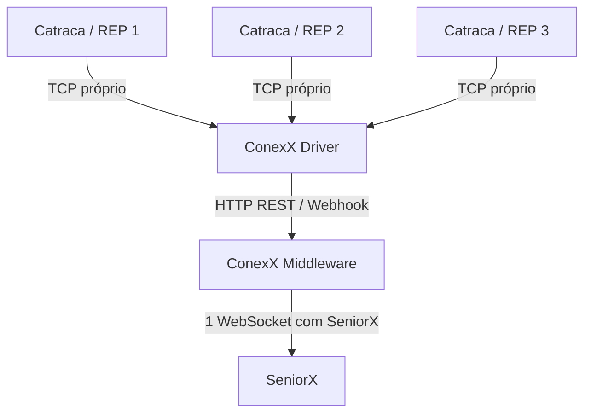
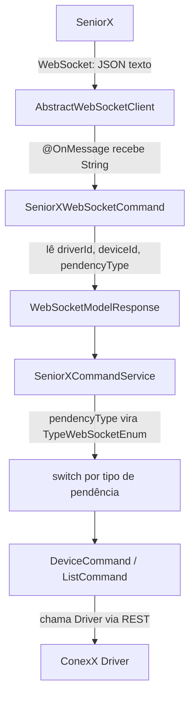
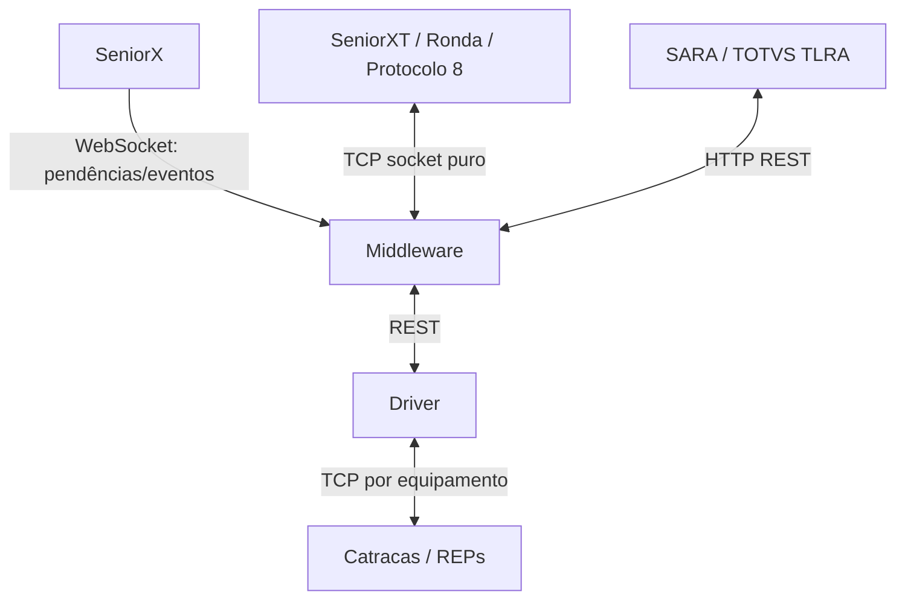

O protocolo WebSocket, RFC 6455, fornece uma maneira padronizada de estabelecer um canal de comunicação bidirecional *full-duplex* entre cliente e servidor em uma única conexão TCP. É um protocolo TCP diferente do HTTP, mas foi projetado para funcionar sobre HTTP, usando as portas 80 e 443 e permitindo a reutilização de regras de firewall existentes.

Uma interação WebSocket começa com uma requisição HTTP que usa o cabeçalho #Upgrade do HTTP para atualizar ou, neste caso, mudar para o protocolo WebSocket. O exemplo a seguir mostra uma interação deste tipo:

```http
GET /spring-websocket-portfolio/portfolio HTTP/1.1
Host: localhost:8080
Upgrade: websocket
Connection: Upgrade
Sec-WebSocket-Key: Uc9l9TMkWGbHFD2qnFHltg==
Sec-WebSocket-Protocol: v10.stomp, v11.stomp
Sec-WebSocket-Version: 13
Origin: http://localhost:8080
```
Header *Upgrade*, usando a conexão *Upgrade*.

Ao invés do código de status 200 habitual, um servidor com suporte a WebSocket retorna uma saída semelhante à seguinte:

```http
HTTP/1.1 101 Switching Protocols
Upgrade: websocket
Connection: Upgrade
Sec-WebSocket-Accept: 1qVdfYHU9hPOl4JYYNXF623Gzn0=
Sec-WebSocket-Protocol: v10.stomp
```

Após um *handsnake* (negociação inicial) bem-sucedido, o socket TCP subjacente à requisição de atualização HTTP permanece aberto tanto para o cliente quanto para o servidor continuarem a enviar e receber mensagens.

Uma introdução completa de como os WebSockets funcionam está fora do escopo deste documento. Consulte a RFC 6455, o capítulo de WebSocket do HTML5, ou qualquer uma das muitas introduções e tutoriais da web.

Notemos que, se um servidor WebSocket estiver rodando atrás de um servidor web (por exemplo, nginx), provavelmente precisaremos configurá-lo para repassar as requisições de atualização WebSocket para o servidor WebSocket. Da mesma forma, se a aplicação rodar em um ambiente de nuvem, verificaremos as instruções do provedor de nuvem relacionadas ao suporte a WebSocket.

## HTTP Versus WebSocket
Embora o WebSocket seja projetado para ser compatível com HTTP e comece com uma requisição HTTP, é importante entender que os dois protocolos levam a arquiteturas e modelos de programação de aplicações muito diferentes. 

Em HTTP e REST, uma aplicação é modelada como várias URLs. Para interagir com a aplicação, os clientes acessam essas URLs no estilo requisição-resposta. Os servidores roteiam as requisições para o manipulador *handler* apropriado com base na URL HTTP, no método e nos cabeçalhos.

Em contraste, em WebSockets, geralmente <span style="background:#d3f8b6">há apenas uma URL para a conexão inicial</span>. Posteriormente, todas as mensagens da aplicação fluem nessa mesma conexão TCP. Isso aponta para uma arquitetura de mensagens assíncrona e orientada a eventos completamente diferente. 

> No caso, cada equipamento nosso cria um canal de comunicação, cada catraca, relógio de ponto, ou apenas o middleware que cria um canal com o SeniorX?

Não, não abre um WebSocket por equipamento. Abre um canal WebSocket do #Middlware com a SeniorX, e dentro dele trafegam mensagens sobre vários equipamentos. No ConexX, isso acontece entre o #Middlware e a #SeniorX, não entre cada equipamento e o Middleware. Cada equipamento conversa primeiro com o #Driver, em seu próprio socket TCP.



O WebSocket também é um protocolo de transporte de baixo nível que, ao contrário do HTTP, não prescreve nenhuma semântica para o conteúdo das mensagens. Isso significa que não há como rotear ou processar uma mensagem a menos que o cliente e o servidor concordem com a semântica da mensagem. 
**Como isso acontece em nosso projeto?**

> Em nosso projeto, isso acontece por um **contrato de mensagem próprio da SeniorX, não por uma regra do WebSocket.** O WebSocket só entrega uma String. Quem dá significado para essa String é este fluxo:



O recebimento cru da mensagem acontece neste trecho:
AbstractWebSocketClient.java (line 61)
```JAVA
@OnMessage
public void onMessage(String msg, Session session) {
	handleMessage(msg);
}
```

Depois a mensagem ganha formato aqui:
**SeniorXWebSocketCommand.java (line 41)**
Ele espera um JSON com estes campos:
```java
{
  "driverId": "algum-id",
  "deviceId": "algum-equipamento",
  "pendencyType": "BLOCK_DEVICE"
}
```

O campo mais importante é o *pendencyType*.
Sendo convertido para este enum:
**TypeWebSocketEnum.java**
```java
DEVICE_STATUS
DEVICE_DATE_TIME
BLOCK_DEVICE
UNBLOCK_DEVICE
ALLOW_CARD_LIST
INCLUDE_CARD
EXCLUDE_CARD
INCLUDE_BIOMETRY
EXCLUDE_BIOMETRY
INCLUDE_PHOTO
EXCLUDE_PHOTO
```

E o roteamento real acontece aqui:
SeniorXCommandService.java (line 44)

Principalmente neste ponto:
```java
TypeWebSocketEnum type = TypeWebSocketEnum.valueOf(message.getPendencyType());

switch (type) {
  case BLOCK_DEVICE -> deviceCommand.handleBlockDevice(...);
  case UNBLOCK_DEVICE -> deviceCommand.handleUnblockDevice(...);
  case ALLOW_CARD_LIST -> listCommand.handleAllowCardList(...);
  case INCLUDE_CARD -> listCommand.handleIncludeCard(...);
}
```

Portanto, no projeto, a semântica combinada é:
SeniorX e Middleware concordam que a mensagem WebSocket será um JSON contendo *driverId*, *deviceId* e principalmente *pendencyType*.

O #pendencyType é o verbo da mensagem. Ele diz ao Middleware o que fazer.

Exemplo mental:
```java
{
	"deviceId": "10",
	"pendencyType": "BLOCK_DEVICE"
}
```
Significa
*"Existe uma pendência para bloquear um equipamento."*
Aí o Middleware entende *BLOCK_DEVICE*, busca as pendências completas na API da SeniorX e chama o handler correto para depois conversar com o Driver.

Um detalhe importante: neste projeto, o WebSocket da SeniorX parece funcionar mais como um **aviso de pendência** do que como uma mensagem completa com todo o payload. Quando chega a mensagem, o SeniorXCommandService chama:
```java
AllPendency allPendency = findAllPendency();
```

Ou seja: ele recebe o alerta pelo WebSocket, mas busca os dados completos pela API REST da SeniorX.

Resumo bem direto:
- O WebSocket não sabe o que é BLOCK_DEVICE.
- A SeniorX envia pendencyType: "BLOCK_DEVICE".
- O Middleware transforma isso em TypeWebSocketEnum.BLOCK_DEVICE.
- O switch escolhe o handler correto.
- O handler manda a ação para o Driver.
- O Driver conversa com a catraca/REP/equipamento.

Então a “semântica da mensagem” no projeto está concentrada em três lugares: WebSocketModelResponse, TypeWebSocketEnum e SeniorXCommandService.

Clientes e servidores WebSocket podem negociar o uso de um protocolo de mensagens de nível mais alto (por exemplo, STOMP), através do cabeçalho *SecWebSocket-Protocol* na requisição de handshake HTTP. Na ausência disso, eles precisam criar suas próprias convenções.

## Quando Usar Websockets
Os WebSockets podem tornar uma página da web dinâmica e interativa. No entanto, em muitos casos, uma combinação de AJAX e *Streaming* HTTP ou *long poling* pode fornecer uma solução simples e eficaz. 

Por exemplo, feeds de notícias, e-mails e redes sociais precisam ser atualizados dinamicamente, mas pode ser perfeitamente aceitável fazer isso a cada poucos minutos. Ferramentas de colaboração, jogos e aplicativos financeiros, por outro lado, precisam estar muito mais próximos do tempo real.

A latência por si só não é um fator decisivo. Se o volume de mensagens for relativamente baixo (por exemplo, monitoramento de falhas de rede), o *streaming* HTTP ou *polling* pode fornecer uma solução eficaz.<span style="background:#fff88f"> É a combinação de baixa latência, alta frequência e alto volume que compõem o melhor caso para o uso do WebSocket</span>.


Tenha em mente que, na Internet, proxies restritivos que estão fora do nosso controle podem impedir interações WebSocket, seja porque não estão configurados para repassar o cabeçalho *Upgrade* ou porque fecham conexões de longa duração que parecem ociosas. Isso significa que o uso do WebSocket para aplicações internas dentro do firewall é uma decisão mais simples e direta do que para aplicações voltadas para o público.


**Stack Reativa vs Stack Servlet:** a "Servlet Stack" é o modelo tradicional do Spring MVC (síncrono e bloqueante, rodando sobre servidores como Tomcat). A "Reactive stack" refere-se ao Spring WebFlux, focado em alta concorrência e processamento não-bloqueante.

**StockJS:** é uma biblioteca (e um módulo suportado no ecossistema de desenvolvimento backend) que funciona como uma rota de fuga de segurança (*fallback*). Se um ambiente de rede bloqueia conexões WebSockets puras, o SockJS simula a conexão em tempo real utilizando outras abordagens (como *long polling*) de forma totalmente  transparente para o código.

**STOMP (Simple Text Oriented Messaging Protocol)**: o WebSocket é "cego" em relação à organização das mensagens, ele apenas trafega pacotes. O STOMP age como um padrão organizacional por cima do WebSocket. É ele que permite a criação de rotas de processamento direcionadas, permitindo usar lógicas equivalentes aos controladores REST habituais (como mapear @MessageMapping ou publicar algo diretamente em uma fila de inscritos).

**Full-duplex:** significa que os dados transitam nos dois sentidos de forma simultânea e independente. No HTTP  , ocorre o padrão *half-duplex* (o cliente pede, o canal fica ocupado enviando a resposta e depois é fechado). No *full-duplex*, enquanto o servidor processa e envia uma resposta contínua, o cliente pode paralelamente enviar novas instruções pela mesma conexão.

**Handshake e Cabeçalho Upgrade:** Todo WebSocket começa como uma chamada HTTP perfeitamente normal. A requisição HTTP REST vai até o servidor e diz: "Podemos transformar essa nossa conexão atual em túnel WebSocket?". Se o servidor validar o *handshake* e concordar, a linguagem de comunicação muda e a conexão fica permanentemente aberta.

**Código HTTP 101:** este é o código oficial para o servidor sinalizar que topou fazer o *Upgrade*. Ao invés de um tradicional retorno como *200 OK* (que encerraria o processamento devolvendo um corpo de resposta estático), o 101 *Switching Protocols* indica a mudança de comportamento do fluxo de rede.

**Long Polling:** uma alternativa onde o cliente manda uma requisição HTTP, mas o servidor segura a requisição em aberto até que ele tenha um dado novo para entregar. Reduz as chamadas excessivas do AJAX tradicional, mas ainda consome mais recursos e cabeçalhos de rede do que o WebSocket.

**Alta Frequência em Aplicações Financeiras e Jogos:** em sistemas que exigem processamento instantâneo, como o envio contínuo de coordenadas em partidas de League of Legends ou o fluo ininterrupto de dados estatísticos (para alimentar cálculos dinâmicos de Bandas de Bollinger num painel de setup de trading), a arquitetura de baixo custo e alta frequência de requisições do WebSocket o torna indispensável.

O Spring Boot oferece configuração automática de WebSockets para Tomcat e Jetty embutidos. Se implementarmos um arquivo WAR em um contêiner independente, o Spring Boot assume que o contêiner é responsável pela configuração do seu suporte a WebSockets.

O Spring Framework oferece **amplo suporte a WebSockets** para aplicações web MVC, que podem ser facilmente acessados através do *spring-boot-starter-websocket* módulo.

O suporte a WebSocket também está disponível para aplicações web reativas e requer a inclusão da API WebSocket juntamente com **spring-boot-starter-webflux.**


---
Cada parceiro da Telemática fala em um "idioma" diferente. O Middleware não escolhe WebSocket como padrão; ele se adapta ao contrato de integração de cada sistema.



Então o SeniorXT já tem uma conexão persistente, mas **não é WebSocket**. É TCP bruto com protocolo próprio.

**SARA não usa WebSocket porque a integração dela é REST.** O Middleware chama endpoints HTTP da TOTVS/TLRA, como acesso, dispositivos e biometrias.

SeniorX conversa por WebSocket porque precisa empurrar pendências para o Middleware. SeniorXT conversa por TCP porque o contrato dele é Protocolo 8. Sara conversa por REST porque a API dela é request/response HTTP.