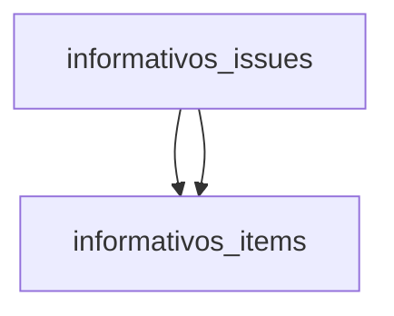
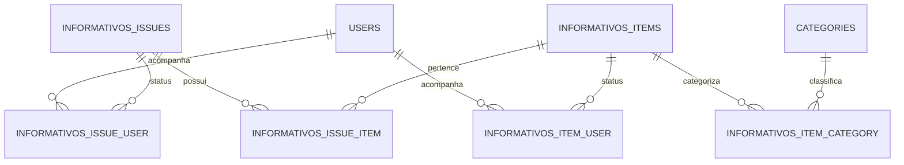

![[mermaid-diagram (2).png]]
## Model **Ideia Central**
A área de informativos gira em torno de duas coisas:
1. **InformativoIssue** = uma edição do informativo. 
	- Exemplo: "Informativo STF 1001";

2. **InformativoItem** = um conteúdo dentro dessa edição.
	- Exemplo: um julgado, uma súmula, um tema.

**Onde isso fica no código**
- As URLs dos informativos ficam em routes/informativos.php
- A lógica da página de listagem das edições fica em InformativosIssueController.php
- A lógica da página de um item fica em InformativosItemController.php
- O modelo da edição fica em InformativosIssue.php
- O **modelo** do item fica em InformativosItem.php
- A tela da edição fica em issue.blade.php
- A tela do item fica em item.blade.php

**Como pensar o fluxo**
Quando alguém entra em uma URL tipo `/informativos/slug-da-edicao`:
1. A rota em *routes/informativos.php* manda para o controller;
2. O controller busca a edição e os itens no banco;
3. A view mostra isso na tela.

## Banco de dados
As tabelas principais são estas:
- *informativos_issues*: guarda as edições dos informativos;
- *informativos_items*: guarda os itens/julgados/súmulas/temas
- *informativos_issue_item:* tabela que liga edição com item
- *informativos_item_category:* liga item com categoria
- *informativos_item_user*: guarda se um usuário marcou item como completo/favorito
- *informativos_issue_user:* guarda se um usuário marcou edição como completa/favorita

**Diagrama simples do banco**

## Fluxo de Alimentação Informativo
Hoje, para um **novo informativo** do site, o processo é **principalmente manual:**
- A edição do informativo é criada manualmente no *admin Filament* em *InformativosIssueResource.php*

- Essa criação usa o fluxo padrão do Filament em *CreteInformativosIssue.php*

- No formulário, a pessoa preenche nome, número, instituição, tipo, data, slug, assunto e pode subir o PDF em S3 (url_inteiro_teor);

- O fluxo prático parece ser este:
1. Alguém cria a edição do informativo no admin;
2. Essa edição vai para a tabela *informativos_issues*;
3. Depois os **itens/julgados** entram de um destes jeitos:
	1. Manualmente, pelo CRUD de julgados em *InformativosItemResource.php*;
	2. Ou por extração com IA, acionada manualmente em **ExtractJulgados.php**
4. Os itens vão para **informativos_items**
5. A ligação entre edição e item vai para a pivot *informativos_issue_item*.

**Parte com IA semi-automática**
- A página de extração só funciona para um *InformativosIssue* que já existe e já tem PDF.
- O job *ExtractJulgadosFromInformativoJob.php* chama o serviço *JulgadoExtractionService.php*
- Este serviço cria *InformativosItem*, cria/acha relatores e vincula categorias e a edição.
- Ou seja: a IA ajuda a preencher os julgados.

Para o cadastro normal de um novo informativo, o fluxo principal está dentro do próprio Laravel/PHP.
- o admin usa Filament em *informativosIssueResource.php*;
- ao salvar, a edição entre direto no banco pelo model *InformativosIssue.php*

Mas o módulo de informativos **também conversa com serviços externos** em alguns pontos:
- S3 para armazenar DPF do informativo e arquivos relacionados;
	- *InformativosIssueResource.php*
- **Gemini API** para extração automática de julgados a partir do PDF
	- *JulgadosExtractionService.php*
- API externa *update-testes.up.railway.app* para atualizar automaticamente Jurisprudência em Teses e alguns temas
	- UpdateJurisprudencia.php
	- TemasStfHandler.php
	- TemasStjHandler.php

- Meilisearch para busca:
	- config/scout.php

## Tipos diferentes

O **tipo da edição** do informativo, isso fica em *informativos_issues.type* e é exatamente esse campo com 3 opções no cadastro.

O **tipo do item dentro da edição**
	Isso fica em *informativos_items.type* e pode ser **julgado**, **sumula**, **tese-stf**, **tema-stf**, **tema-stf-rep** etc.

**As 3 opções do cadastro**  
Todas usam a mesma tabela informativos_issues, o mesmo model InformativosIssue.php e o mesmo CRUD em InformativosIssueResource.php. O que muda é o valor do campo type.

|Tipo no cadastro|O que significa|Como aparece no site|Que itens costuma ter|
|---|---|---|---|
|informativo|uma edição normal de informativo|/informativos|normalmente julgado|
|principais|uma seleção editorial de julgados mais importantes|/principais-julgados|normalmente julgado|
|jurisprudencia-em-teses|uma edição temática de teses consolidadas|/jurisprudencia-em-teses|normalmente tese-jurisprudencia|

**Em português simples**
- **informativo**: "edição normal com vários julgados comentados"
- **principais**: "edição especial com os casos mais importantes"
- **jurisprudencia-em-teses**: "edição organizada por teses/entendimento, não por julgados comuns"

**Exemplo mental**  
Pensa assim:

- Informativo
    - “Informativo STF 1200”
    - dentro dele: vários julgados
- Principais Julgados
    - “Principais Julgados de 2025”
    - dentro dele: casos mais relevantes daquele período
- Jurisprudência em Teses
    - “Jurisprudência em Teses 240”
    - dentro dele: teses organizadas por assunto

## Automação
