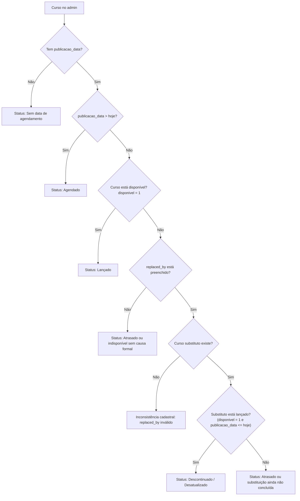

## 2026-03-14 (FAZENDO)
Hoje o sistema **sabe se há data de lançamento**, mas ainda não sabe com segurança se um curso indisponível está **atrasado** ou foi **substituído**.  
A melhoria proposta cria uma leitura mais fiel do ciclo de vida dos cursos e reduz ambiguidade operacional.  
O *elemento-chave* para isso funcionar de forma confiável é garantir o preenchimento do campo ID do Curso Mais Atualizado (substituto).

**Problema identificado**  
Atualmente, o status visível no admin está fortemente baseado em publicacao_data. Isso é útil, mas insuficiente para representar o ciclo de vida real do curso.

Exemplo observado:
- Curso antigo: disponivel = 0, publicacao_data antiga
- Curso novo: disponivel = 1, publicacao_data também já passada
- Campo ID do Curso Mais Atualizado (substituto) não preenchido

Nesse cenário, o sistema não consegue afirmar formalmente que o curso antigo foi descontinuado por substituição, mesmo quando isso parece evidente operacionalmente.

**Sugestão de melhoria**  
Transformar o status de agenda em um status operacional de lançamento, com regras mais claras.
Sugestão de status:

- Não Agendado
    - curso sem publicacao_data
- Agendado
    - curso com publicacao_data futura
- Lançado
    - curso com publicacao_data passada ou atual e disponivel = 1
- Atrasado
    - curso com publicacao_data passada ou atual e disponivel = 0, sem substituição formal registrada
- Descontinuado / Desatualizado
    - curso com disponivel = 0 e com ID do Curso Mais Atualizado (substituto) preenchido apontando para um curso **substituto já lançado**

**Benefícios esperados**
- melhora da leitura operacional no painel
- distinção clara entre curso futuro, curso publicado, curso atrasado e curso substituído
- redução de erros de interpretação pela equipe editorial e administrativa
- maior confiabilidade para filtros e indicadores no admin

**Ponto crítico para viabilizar essa lógica**  
Para que o status Descontinuado / Desatualizado funcione de forma confiável, o campo **ID do Curso Mais Atualizado (substituto)** precisa ser tratado como fonte oficial de substituição entre cursos.

Hoje esse campo existe, **mas nem sempre está preenchido**. Sem ele, a substituição fica implícita e o sistema não consegue classificá-la com segurança.

### **Proposta para garantir o preenchimento do campo**  
Sugiro combinar regra de processo com validação sistêmica.
1. Tornar o campo obrigatório em cenários específicos  
    Quando um curso for marcado como indisponível, o sistema deve exigir uma decisão:
    - o curso está indisponível **temporariamente**
    - ou **foi substituído por um curso mais atualizado**

Se foi substituído, o campo ID do Curso Mais Atualizado (substituto) deve ser obrigatório.
2. Criar validação condicional no admin  
    Se disponivel = 0, o sistema pode exigir pelo menos uma destas condições:
    - preenchimento de replaced_by
    - ou uma justificativa/status explícito de indisponibilidade

Isso evita que cursos antigos fiquem sem classificação clara.
3. Adicionar regra de consistência  
    Quando replaced_by for preenchido, validar que:
    - o curso substituto existe
    - o curso substituto não é ele mesmo
    - opcionalmente, o curso substituto esteja disponível ou já lançado
4. Ajustar o fluxo operacional da equipe  
    Na prática, o processo pode ficar assim:
    - ao lançar uma nova versão de um curso, o curso novo é criado/publicado
    - o curso antigo é marcado como indisponível
    - o campo ID do Curso Mais Atualizado (substituto) do curso antigo recebe o ID do novo curso
5. Criar monitoramento administrativo  
    Adicionar um filtro futuro para:
    - Cursos indisponíveis sem substituto  
        Isso ajuda a equipe a identificar registros incompletos e corrigir o cadastro.

